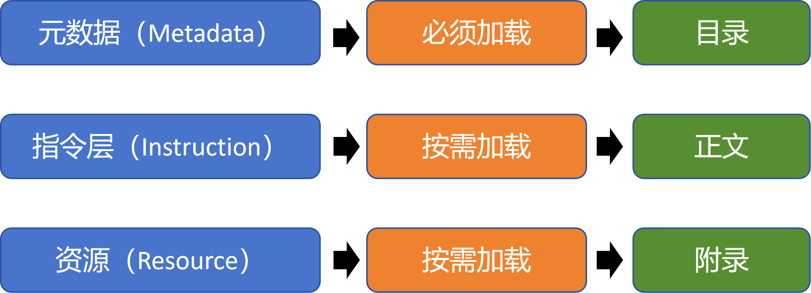
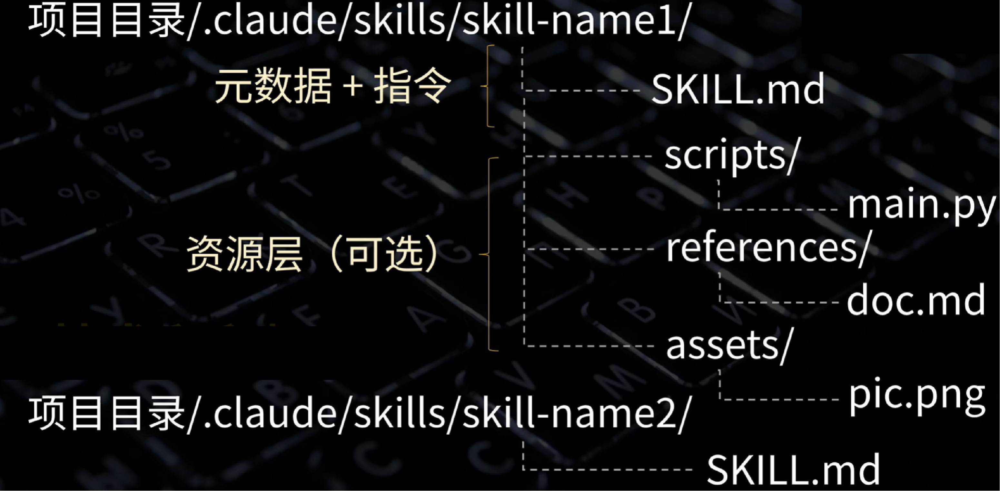
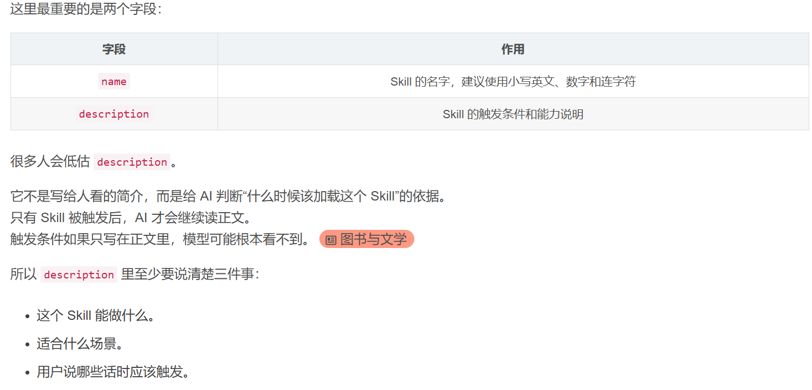
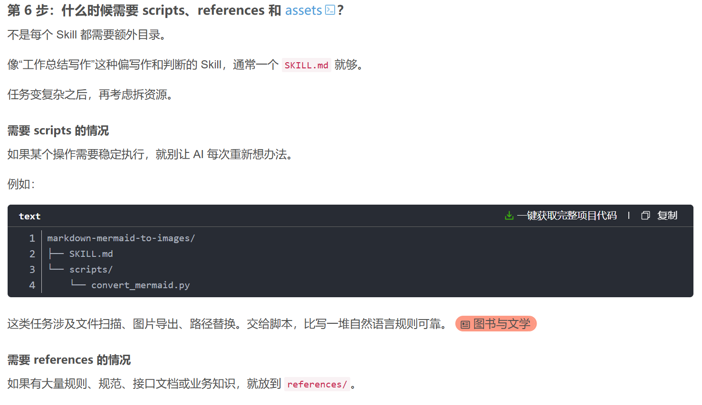

# 1.Skill的组成与介绍
###### 学习摘录笔记来自CSDN<a href="https://blog.csdn.net/weixin_42782643/article/details/157402359">Agent Skills完全指南：核心概念丨设计模式丨实战代码</a>
* 1）元数据（Metadata）
* 2）指令（Instruction）
* 3）资源（Resource）


* 元数据如同书的目录，告诉模型有哪些可用的能力；
* 指令如同书的正文，详细说明在某一能力下如何执行某项任务；
* 资源如同书的附录，提供对某一能力的必要的补充材料（如代码示例、数据模板等）。
* 智能体在执行时，首先仅载入“目录”（元数据），随后根据实际需求，再决定是否查阅该目录下的“正文”（指令）与“附录”（资源）

# 2.Skill的设计模式

###### 学习摘录笔记来自CSDN<a href="https://blog.csdn.net/weixin_42782643/article/details/157402359">Agent Skills完全指南：核心概念丨设计模式丨实战代码</a>

## 1)Skill 的目录结构： 

在 Claude Code 项目中，Skills 存放在 项目目录/.claude/skills/ 路径下。每个 Skill 都是一个独立的文件夹，其中必须包含一个名为 SKILL.md 的定义文件（注意大写）。此文件包含了该 Skill 的元数据层和指令层。此外，文件夹内还可存放其他辅助文件，它们构成了 Skill 的资源层。

## 2) 资源层的组织：

可以在 Skill 文件夹内创建子目录（如 scripts, references, assets）来分类存放资源文件，使结构更清晰。资源文件可以是可执行脚本、补充说明文档，也可以是图片等其它资源，
标准做法是将可执行Python文件放到scripts子文件夹中，把文档放到references这个子文件夹里面，把图片等其它资源放到assets子文件夹里面

# 3.Skill创建流程
## 1）创建 Skill 文件夹

 在项目根目录（例如笔者这里是 skill-project）下，依次创建 .claude\skills\字幕转markdown 文件夹，并在其中创建 SKILL.md 文件(注意名称必须为SKILL.md，大小写都要一致)。

## 2）编写skill元数据

在SKILL.md 文件中首先写入元数据，元数据用于描述 Skill 的基本信息，需用 --- 包裹。它会被优先加载到大模型上下文中，相当于“能力目录”
```markdown
---
name: srt字幕转markdown笔记
description: 把srt字幕文件转换为markdown笔记
---
```

## 3）编写skill指令层
在SKILL.md 文件中元数据后面紧接着编写指令部分，指令部分定义了 Skill 的具体操作逻辑和详细要求，采用 Markdown 格式编写。
```
你是专业的字幕文本处理助手，任务是将sRT 字幕完整转换为 Markdown 笔记，并添加标点、段落格式和必要的截图占位符。要求
如下:
1.**内容完整保留**:禁止任何删减、总结或省略，必须逐字保留 SRT 所有文字。
2.**语言规则**:使用中文书写，保留必要的英文专有名词。
3.**段落结构**:
    -仅使用一个层级的段落
    -每个段落标题使用## 标题
    -第一段为引言，不使用标题
    -只需要划分2-3个段落
4. **标点与排版**:
    -为每句话添加合适标点
    -适当划分自然段
5.**截图占位符规则(按需插入)**
    -当某句符合以下任一条件时，在句末添加截图标记:
    -代码讲解
    -UI 交互操作
    -包含"这么、这里、这儿"等视觉指代词
    -提及网址/链接/地址(包括 GitHub、API endpoint等)
    -任何借助视觉材料更易理解的内容
    -形式必须严格为:
    ```
    Screenshot-[hh:mm:ss]
    ```
    -仅在真正有助理解时插入，不可滥用
    比如:
    ```
    原始SRT
    00:02:08,600-->00:02:09,800
    安装这个工具
    ```
6. **输出文件格式**:
    - 生成内容保存为单个Markdown 文件，命名为:
    ```
    项目根目录/xxx.md
    ```
```

## 4）添加可执行脚本
* 在 字幕转markdown 这个 Skill 的目录下，创建一个 scripts 子文件夹，并放入一个 Python 脚本 screenshot.py。该脚本的功能是：根据 Markdown 中生成的截图标记（如 Screenshot-[00:03:12]），调用 ffmpeg 从对应的视频文件中截取相应时间点的画面，并将标记替换为实际的图片链接。

* 更新指令以调用资源： 在 SKILL.md 的指令部分末尾，添加调用该脚本的步骤。
* 什么时候使用拓展脚本/资源：

```
7.**后续处理**:
    markdown生成完毕以后，调用
    python scripts/screenshot.py
    对视频进行截图，执行python脚本时不需要传递任何参数

```
# 4.手写Skill vs Skill-creator

## 4.1 手写Skill的常见问题
* description太宽泛，导致该描述在任何时候都会触发，边界太宽。
* description部分写的太过简略
* 所有东西都塞入SKILL.md文件中，导致文件体积过大，维护困难。
* 没有写反例和禁区。常见反例：
```
不要虚构数据。
不要写口号。
不要把小问题写成严重事故。
不要为了凑字数重复表达。
```
## 4.2 用skill-creator自动创建skill
###### 笔记来源<a href="https://blog.csdn.net/m0_67275869/article/details/161301540?spm=1001.2014.3001.5506">手把手教你写一个 AI Skill，让 AI 真正学会你的工作流</a>

#### 1） 安装skill-creator
```
npx skills add https://github.com/anthropics/skills --skill skill-creator
```
可以直接这样要求claude code:
```
使用 skill-creator，帮我创建一个 work-summary-writing skill。

目标：
当用户需要写工作总结、周报、月报、季度总结、年度总结、项目复盘或阶段性汇报时触发。

能力：
1. 判断总结范围和字数要求。
2. 从零散工作记录中提炼核心工作。
3. 整理工作成果、问题不足、经验总结和下一步计划。
4. 输出正式、自然、结构清晰的工作总结。

注意事项：
1. 不要虚构关键事实、数据、项目名称或成果。
2. 信息不足时使用稳妥表达。
3. 避免口号式语言。
4. 下一步计划要具体可执行。

位置：
安装到全局 Claude skills 目录。

```
#### 2）手写vsskill-creator：


