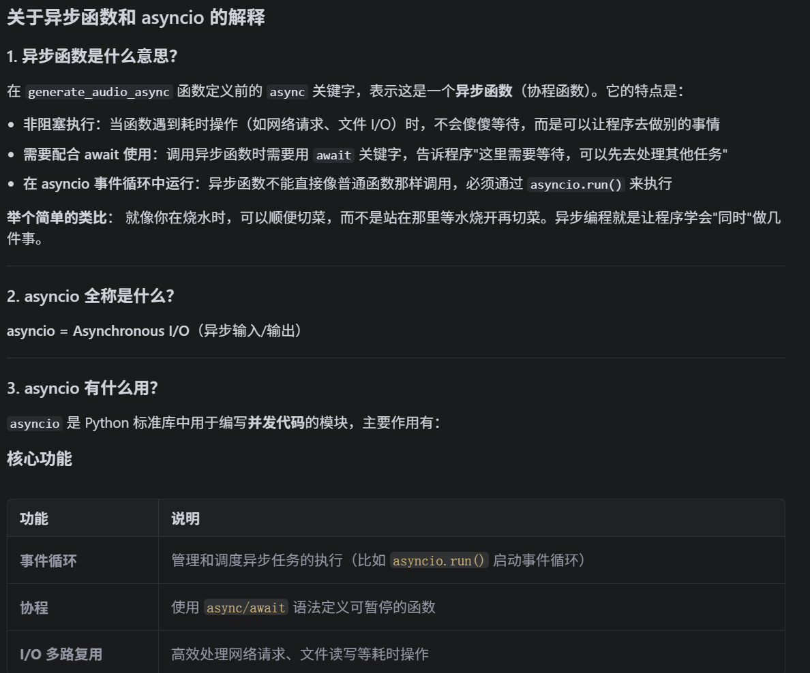
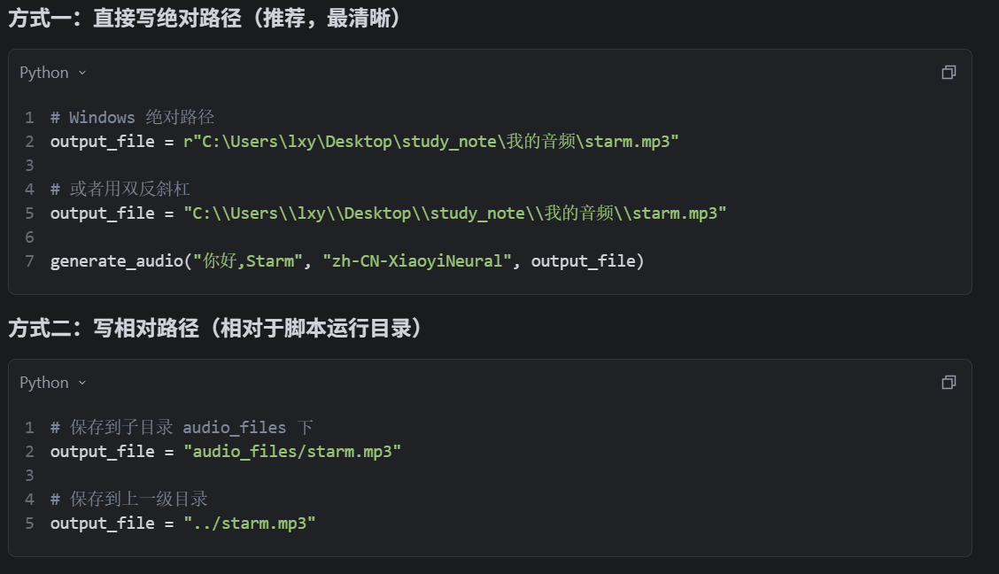

- [1.安装与环境设置](#1安装与环境设置)
- [2.同步与异步](#2同步与异步)
- [3.edge\_tts(text to speech)的文本转语音使用方法：](#3edge_ttstext-to-speech的文本转语音使用方法)
    - [（1）实例化Communicate对象,并传入文本和语音类型参数](#1实例化communicate对象并传入文本和语音类型参数)
    - [（2）保存音频](#2保存音频)
    - [（3）完整函数展示](#3完整函数展示)
- [4.查找音色方法](#4查找音色方法)
    - [4.1 调用VoiceManager.create()方法寻找所有音色](#41-调用voicemanagercreate方法寻找所有音色)
    - [4.2 利用find（）方法筛选符合条件的音色](#42-利用find方法筛选符合条件的音色)
    - [4.3 完整代码展示](#43-完整代码展示)

# 1.安装与环境设置
```
pip install edge-tts
```
# 2.同步与异步
* 异步函数：

* 如上，通过async fuc()+await 方法+asyncio.run(fuc)可以实现一般异步处理
# 3.edge_tts(text to speech)的文本转语音使用方法：

### （1）实例化Communicate对象,并传入文本和语音类型参数
```python
communicate = edge_tts.Communicate(text, voice)
```
### （2）保存音频
```python
await communicate.save(output_file)
```
* 保存音频时的路径选择:

### （3）完整函数展示
```python
import asyncio
import edge_tts

def generate_audio(text: str, voice: str, output_file: str) -> None:
    """
    传入文本、语音及输出文件名，生成语音并保存为音频文件
    :param text: 需要合成的中文文本
    :param voice: 使用的语音类型，如 'zh-CN-XiaoyiNeural'
    :param output_file: 输出的音频文件名
    """
    async def generate_audio_async() -> None:
        """异步生成语音"""
        communicate = edge_tts.Communicate(text, voice)
        await communicate.save(output_file)

    # 异步执行生成音频
    asyncio.run(generate_audio_async())

# 示例调用
generate_audio("今天天气不错，适合出门玩耍。", "zh-CN-XiaoyiNeural", "weather.mp3")

```

# 4.查找音色方法
### 4.1 调用VoiceManager.create()方法寻找所有音色
### 4.2 利用find（）方法筛选符合条件的音色

### 4.3 完整代码展示
```python
import asyncio
import edge_tts
from edge_tts import VoicesManager

async def print_available_voices(language: str = "zh", gender: str = None) -> None:
    """
    异步查找并打印符合特定条件的语音列表。
    :param language: 语音的语言，如 "zh-CN" 表示中文
    :param gender: 可选参数，选择语音的性别（"Male" 或 "Female"），默认不指定
    """
    # 异步获取所有可用语音
    voices = await VoicesManager.create()

    # 根据语言过滤语音
    filtered_voices = voices.find(Language=language)
    if gender:
        filtered_voices = [voice for voice in filtered_voices if voice["Gender"] == gender]
    
    # 打印符合条件的语音
    if filtered_voices:
        print(f"符合条件的语音：")
        for voice in filtered_voices:
            print(f"语音名称: {voice['Name']}, 性别: {voice['Gender']}, 语言: {voice['Language']}")
    else:
        print(f"没有找到符合条件的语音：语言={language}, 性别={gender}")

# 示例调用
async def main():
    await print_available_voices(language="zh", gender="Female")

# 运行异步示例
if __name__ == "__main__":
    asyncio.run(main())

```