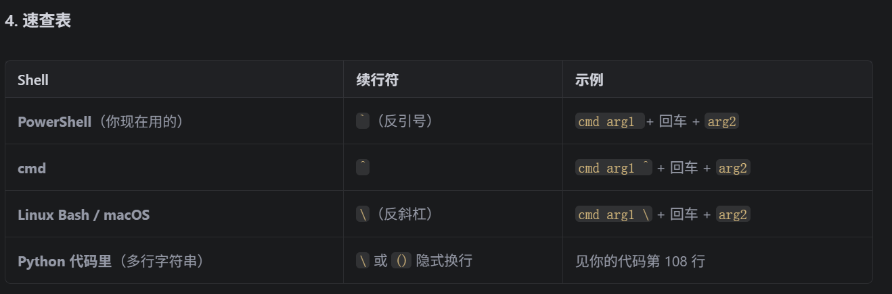

```
python "C:\Users\lxy\Desktop\deep learning\V2ADynamic_Vgg\V2ADynamic_Vgg\龙星月note\详细技术细节\案例练习\视频处理.py" `
    -videos_dir "D:\v2a_my\landscape\train_mp4" `
    -save_dir "C:\Users\lxy\Desktop\deep learning\V2ADynamic_Vgg\V2ADynamic_Vgg\龙星月note\详细技术细节\案例练习\提取的视频特征" `
    -batch_size 20 `
    -videos_length 10 `
    -multi_thread False
```

